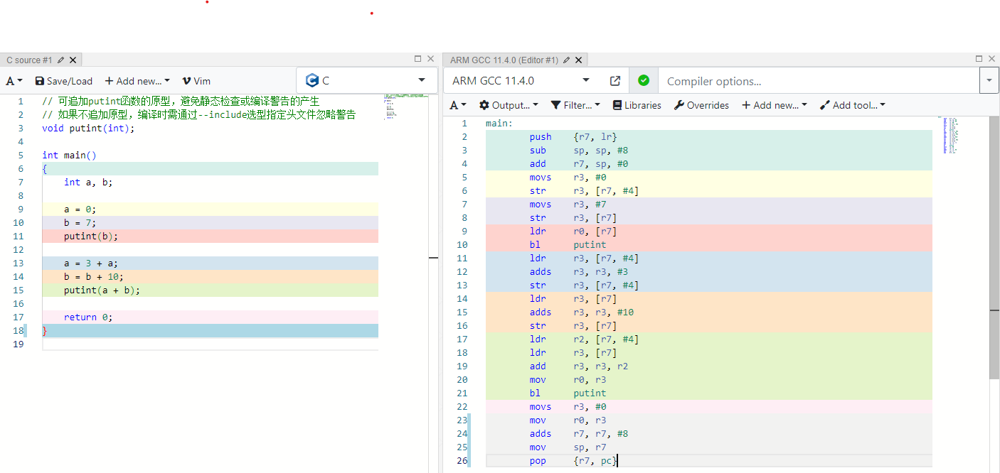

# 1. MiniC编译器-表达式版

## 1.1. 编译器的功能

在基本版的基础上，还支持如下的功能：
1. 支持int类型的全局变量定义，不支持变量初始化设值；
2. 函数可定义多个，但不支持形参，函数返回值仍然是int类型；
3. 函数内支持int类型的局部变量定义，不必在语句块的开头；
4. 支持赋值语句，不支持连续赋值；
6. 支持语句块；
5. 表达式支持加减、函数调用、带括号的运算；
7. 支持内置函数putint，通过它可在终端显示对应的十进制值；
8. 变量可重名，支持变量分层管理。

源代码位置：<https://github.com/NPUCompiler/exp03-minic-expr.git>

## 1.2. 编译器的文法

### 1.2.1. antlr4格式的文法

antlr4解析器使用了Adaptive LL(*)的全新解析技术，采用动态分析技术，可主动帮助用户解决文法的直接左递归问题，
也就是antlr4内部采用一定的策略改造文法解决直接左递归问题，不需用户手动改造文法。

antlr4实现的文法相比文法LL(1)，简单了很多，大家可通过阅读下文的递归下降分析法使用的文法内容就可知道antlr4的好处。

```antlr
// 源文件编译单元定义
compileUnit: (funcDef | varDecl)* EOF;

// 函数定义，目前不支持形参，也不支持返回void类型等
funcDef: T_INT T_ID T_L_PAREN T_R_PAREN block;

// 语句块看用作函数体，这里允许多个语句，并且不含任何语句
block: T_L_BRACE blockItemList? T_R_BRACE;

// 每个ItemList可包含至少一个Item
blockItemList: blockItem+;

// 每个Item可以是一个语句，或者变量声明语句
blockItem: statement | varDecl;

// 变量声明，目前不支持变量含有初值
varDecl: basicType varDef (T_COMMA varDef)* T_SEMICOLON;

// 基本类型
basicType: T_INT;

// 变量定义
varDef: T_ID;

// 目前语句支持return和赋值语句
statement:
	T_RETURN expr T_SEMICOLON           # returnStatement
	| lVal T_ASSIGN expr T_SEMICOLON    # assignStatement
	| block                             # blockStatement
	| expr? T_SEMICOLON                 # expressionStatement;

// 表达式文法 expr : AddExp 表达式目前只支持加法与减法运算
expr: addExp;

// 加减表达式
addExp: unaryExp (addOp unaryExp)*;

// 加减运算符
addOp: T_ADD | T_SUB;

// 一元表达式
unaryExp: primaryExp | T_ID T_L_PAREN realParamList? T_R_PAREN;

// 基本表达式：括号表达式、整数、左值表达式
primaryExp: T_L_PAREN expr T_R_PAREN | T_DIGIT | lVal;

// 实参列表
realParamList: expr (T_COMMA expr)*;

// 左值表达式
lVal: T_ID;

// 用正规式来进行词法规则的描述

T_L_PAREN: '(';
T_R_PAREN: ')';
T_SEMICOLON: ';';
T_L_BRACE: '{';
T_R_BRACE: '}';

T_ASSIGN: '=';
T_COMMA: ',';

T_ADD: '+';
T_SUB: '-';

// 要注意关键字同样也属于T_ID，因此必须放在T_ID的前面，否则会识别成T_ID
T_RETURN: 'return';
T_INT: 'int';
T_VOID: 'void';

T_ID: [a-zA-Z_][a-zA-Z0-9_]*;
T_DIGIT: '0' | [1-9][0-9]*;

/* 空白符丢弃 */
WS: [ \r\n\t]+ -> skip;
```

### 1.2.2. flex词法

这里只是返回Token类别的Flex脚本。

```flex
"("         { return T_L_PAREN; }
")"         { return T_R_PAREN; }
"{"         { return T_L_BRACE; }
"}"         { return T_R_BRACE; }

";"         { return T_SEMICOLON; }
","         { return T_COMMA; }

"="         { return T_ASSIGN; }
"+"         { return T_ADD; }
"-"         { return T_SUB; }

"0"|[1-9][0-9]*	{ return T_DIGIT; }

"int"       { return T_INT; }
"return"    { return T_RETURN; }
[a-zA-Z_]+[0-9a-zA-Z_]* { return T_ID; }

[\t\040]+   { ; }
[\r\n]+     { ; }
```

### 1.2.3. Bison语法

要想使用Bison进行语法的识别，文法必须满足LR(1)文法。如不能满足，则在y脚本中指定优先级规则，
依据Bison提供的算法优先级指定策略、移进优先归约等规则消除二义性，满足文法的要求。

```bison

// 文法的开始符号
%start  CompileUnit

// 指定文法的终结符号，<>可指定文法属性
// 对于单个字符的算符或者分隔符，在词法分析时可直返返回对应的ASCII码值，bison预留了255以内的值
// %token开始的符号称之为终结符，需要词法分析工具如flex识别后返回
// %type开始的符号称之为非终结符，需要通过文法产生式来定义
// %token或%type之后的<>括住的内容成为文法符号的属性，定义在前面的%union中的成员名字。
%token T_DIGIT
%token T_ID
%token T_INT

// 关键或保留字 一词一类 不需要赋予语义属性
%token T_RETURN

// 分隔符 一词一类 不需要赋予语义属性
%token T_SEMICOLON T_L_PAREN T_R_PAREN T_L_BRACE T_R_BRACE

// 运算符
%token T_ASSIGN T_COMMA T_SUB T_ADD

// 非终结符
// %type指定文法的非终结符号，<>可指定文法属性
%type CompileUnit
%type FuncDef
%type Block
%type BlockItemList
%type BlockItem
%type Statement
%type Expr
%type LVal
%type VarDecl VarDeclExpr VarDef
%type AddExp UnaryExp PrimaryExp
%type RealParamList
%type BasicType
%type AddOp
%%

// 编译单元可包含若干个函数与全局变量定义。要在语义分析时检查main函数存在
// compileUnit: (funcDef | varDecl)* EOF;
// bison不支持闭包运算，为便于追加修改成左递归方式
// compileUnit: funcDef | varDecl | compileUnit funcDef | compileUnit varDecl
CompileUnit : FuncDef | VarDecl | CompileUnit FuncDef | CompileUnit VarDecl ;

// 函数定义，目前支持整数返回类型，不支持形参
FuncDef : T_INT T_ID T_L_PAREN T_R_PAREN Block ;

// 语句块的文法Block ： T_L_BRACE BlockItemList? T_R_BRACE
// 其中?代表可有可无，在bison中不支持，需要拆分成两个产生式
// Block ： T_L_BRACE T_R_BRACE | T_L_BRACE BlockItemList T_R_BRACE
Block : T_L_BRACE T_R_BRACE | T_L_BRACE BlockItemList T_R_BRACE ;

// 语句块内语句列表的文法：BlockItemList : BlockItem+
// Bison不支持正闭包，需修改成左递归形式，便于属性的传递与孩子节点的追加
// 左递归形式的文法为：BlockItemList : BlockItem | BlockItemList BlockItem
BlockItemList : BlockItem | BlockItemList BlockItem ;

// 语句块中子项的文法：BlockItem : Statement
// 目前只支持语句,后续可增加支持变量定义
BlockItem : Statement | VarDecl ;

// 变量声明语句
// 语法：varDecl: basicType varDef (T_COMMA varDef)* T_SEMICOLON
// 因Bison不支持闭包运算符，因此需要修改成左递归，修改后的文法为：
// VarDecl : VarDeclExpr T_SEMICOLON
// VarDeclExpr: BasicType VarDef | VarDeclExpr T_COMMA varDef
VarDecl : VarDeclExpr T_SEMICOLON ;

// 变量声明表达式，可支持逗号分隔定义多个
VarDeclExpr: BasicType VarDef | VarDeclExpr T_COMMA VarDef ;

// 变量定义包含变量名，实际上还有初值，这里没有实现。
VarDef : T_ID ;

// 基本类型，目前只支持整型
BasicType: T_INT ;

// 语句文法：statement:T_RETURN expr T_SEMICOLON | lVal T_ASSIGN expr T_SEMICOLON
// | block | expr? T_SEMICOLON
// 支持返回语句、赋值语句、语句块、表达式语句
// 其中表达式语句可支持空语句，由于bison不支持?，修改成两条
Statement : T_RETURN Expr T_SEMICOLON | LVal T_ASSIGN Expr T_SEMICOLON | Block | Expr T_SEMICOLON | T_SEMICOLON ;

// 表达式文法 expr : AddExp
// 表达式目前只支持加法与减法运算
Expr : AddExp ;

// 加减表达式文法：addExp: unaryExp (addOp unaryExp)*
// 由于bison不支持用闭包表达，因此需要拆分成左递归的形式
// 改造后的左递归文法：
// addExp : unaryExp | unaryExp addOp unaryExp | addExp addOp unaryExp
AddExp : UnaryExp | UnaryExp AddOp UnaryExp | AddExp AddOp UnaryExp ;

// 加减运算符
AddOp: T_ADD | T_SUB ;

// 目前一元表达式可以为基本表达式、函数调用，其中函数调用的实参可有可无
// 其文法为：unaryExp: primaryExp | T_ID T_L_PAREN realParamList? T_R_PAREN
// 由于bison不支持？表达，因此变更后的文法为：
// unaryExp: primaryExp | T_ID T_L_PAREN T_R_PAREN | T_ID T_L_PAREN realParamList T_R_PAREN
UnaryExp : PrimaryExp | T_ID T_L_PAREN T_R_PAREN | T_ID T_L_PAREN RealParamList T_R_PAREN ;

// 基本表达式支持无符号整型字面量、带括号的表达式、具有左值属性的表达式
// 其文法为：primaryExp: T_L_PAREN expr T_R_PAREN | T_DIGIT | lVal
PrimaryExp :  T_L_PAREN Expr T_R_PAREN | T_DIGIT | LVal ;

// 实参表达式支持逗号分隔的若干个表达式
// 其文法为：realParamList: expr (T_COMMA expr)*
// 由于Bison不支持闭包运算符表达，修改成左递归形式的文法
// 左递归文法为：RealParamList : Expr | 左递归文法为：RealParamList T_COMMA expr
RealParamList : Expr | RealParamList T_COMMA Expr ;

// 左值表达式，目前只支持变量名，实际上还有下标变量
LVal : T_ID ;

```

### 1.2.3. 递归下降分析法使用的文法

要想通过递归下降分析法实现语法的识别，其文法必须满足LL(1)文法的要求。

以antlr4的文法为基础，下面阐述如何构造出满足LL(1)文法要求的文法。

1. 非终结符compileUnit的分析

编译单元识别，也就是文法的开始符号，其antlr4中定义的文法如下：
```antlr
compileUnit: (funcDef | varDecl)* EOF
funcDef: T_INT T_ID T_L_PAREN T_R_PAREN block
varDecl: basicType varDef (T_COMMA varDef)* T_SEMICOLON
```

因funcDef的First集合为T_INT，varDecl的First集合也为T_INT，不可区分，不是LL(1)文法，
继续检查两者定义的第二个记号都为T_ID，不可区分；再检查第三个记号，funcDef为左小括号，
变量声明varDecl可以为逗号，可以为等号，可以为分号，从中可以看出从第三个记号开始funcDef和varDecl可以区分。

因此可改造后的compileUnit的产生式为：
```antlr
compileUnit : { T_INT T_ID idtail }
```
其中大括号代表闭包，类似上面的antlr或者EBNF的*。

非终结符idtail代表T_ID尾部可能的符号串，因此idtail的产生式可定义为：
```antlr
idtail : varDeclList | T_L_PAREN T_R_PAREN block
```

非终结符varDeclList可以定义多个变量，每次都在尾部增加一个逗号和标识符，直到最后一个记号为分号，即
```antlr
varDeclList : T_COMMA T_ID <varDeclList> | T_SEMICOLON
```

经过分析最终适合LL(1)文法的产生式为：

```antlr
compileUnit -> { T_INT T_ID idtail } EOF
idtail : varDeclList | T_L_PAREN T_R_PAREN block
varDeclList : T_COMMA T_ID varDeclList | T_SEMICOLON
```

2. 非终结符block的分析

block的antlr4中的文法：
```antlr
block: T_L_BRACE blockItemList? T_R_BRACE;
```
只有一个产生式，满足LL(1)文法，不需要改造，可通过分支来区分?。

3. 非终结符blockItemList的分析

blockItemList的antlr4中的文法：
```antlr
blockItemList: blockItem+;
```
只有一个产生式，满足LL(1)文法，不需要改造，可通过循环来实现+。

4. 非终结符blockItem、varDecl和statement的分析

blockItem的antlr4中的文法：
```antlr
blockItem: statement | varDecl;
varDecl : T_INT T_ID varDeclList
statement:T_RETURN expr T_SEMICOLON | lVal T_ASSIGN expr T_SEMICOLON | block | expr? T_SEMICOLON
lVal: T_ID;
```

分析非终结符的FISRT集合：
```
FIRST(varDecl)=FIRST(T_INT T_ID varDeclList)={T_INT}
FIRST(T_RETURN expr T_SEMICOLON) = {T_RETURN}
FIRST(lVal T_ASSIGN expr T_SEMICOLON) = FIRST(lVal) = {T_ID}
FIRST(block) = FIRST(T_L_BRACE blockItemList? T_R_BRACE) = {T_L_BRACE}
FIRST(expr? T_SEMICOLON) = FIRST(expr) - {ε} ∪ {T_SEMICOLON} = {T_ID, T_L_PAREN, T_SEMICOLON}
FIRST(statement)
= FIRST(T_RETURN expr T_SEMICOLON) ∪ FIRST(lVal T_ASSIGN expr T_SEMICOLON) ∪ FIRST(block) ∪ FIRST(expr? T_SEMICOLON)
= {T_RETURN} ∪ {T_ID} ∪ {T_L_BRACE} ∪ {T_ID, T_L_PAREN, T_SEMICOLON}
= {T_RETURN，T_ID，T_L_BRACE, T_L_PAREN，T_SEMICOLON}
```

从中可以看出FIRST(varDecl)与FIRST(statement)的集合不交，因此，非终结符号blockItem满足LL(1)文法。

非终结符varDecl只有一个产生式，满足LL(1)文法要求。

非终结符statement的各个产生式的FRIST集合存在交集的可能，即：FIRST(lVal T_ASSIGN expr T_SEMICOLON) ∩ FIRST(expr? T_SEMICOLON) = {T_ID}，
因此非终结符statement相关的文法必须改造。

因lVal也就是T_ID，属于非终结符expr的子集，消除lVal都放到expr中，但是存在语义错误的可能，只有左值的才能被赋值，需要在语义分析时检查。
引入非终结符assignExprStmtTail，代表赋值右侧表达式（含赋值运算符）和空串。

改造后的文法为：
```antlr
statement: returnStatement | block | T_SEMICOLON | assignExprStmt T_SEMICOLON
returnStatement : T_RETURN expr T_SEMICOLON
assignExprStmt : expr assignExprStmtTail
assignExprStmtTail : T_ASSIGN expr | ε
```

分析FIRST集合和FOLLOW集合，可得：
```
FOLLOW(assignExprStmtTail) = {T_SEMICOLON}
FIRST(T_ASSIGN expr) = {T_ASSIGN}
```

两者不交，可得，非终结符assignExprStmtTail满足LL(1)文法的要求。

同时非终结符statement也明显满足LL(1)文法的要求。

因此改造后满足LL(1)文法要求的文法为：
```antlr
blockItem: statement | varDecl;
varDecl : T_INT T_ID varDeclList
statement: returnStatement | block | T_SEMICOLON | assignExprStmt T_SEMICOLON
returnStatement : T_RETURN expr T_SEMICOLON
assignExprStmt : expr assignExprStmtTail
assignExprStmtTail : T_ASSIGN expr | ε
```

5. 非终结符expr的分析

下面是antlr中的文法：
```antlr
expr: addExp;
addExp: unaryExp (addOp unaryExp)*;
unaryExp: primaryExp | T_ID T_L_PAREN realParamList? T_R_PAREN ;
primaryExp: T_DIGIT | T_L_PAREN expr T_R_PAREN | lVal ;
lVal: T_ID
```

对于非终结符unaryExp的产生式右侧的FIRST集合有FIRST(primaryExp)和FIRST(T_ID T_L_PAREN realParamList? T_R_PAREN)。
只要两者的FIRST集合不交，就可满足LL(1)文法要求。

```
FIRST(primaryExp) = FIRST(T_DIGIT) ∪ FIRST(T_L_PAREN expr T_R_PAREN) ∪ FIRST(lVal)
FIRST(T_DIGIT) = {T_DIGIT}
FIRST(T_L_PAREN expr T_R_PAREN) = {T_L_PAREN}
FIRST(lVal) = FIRST(T_ID) = {T_ID}
```

从上面的计算可得
```
FIRST(primaryExp) = {T_DIGIT, T_L_PAREN, T_ID}
FIRST(T_ID T_L_PAREN realParamList? T_R_PAREN) = {T_ID}
```

从中可知非终结符unaryExp的产生式右侧符号串的FIRST集合有交集，即
```
FIRST(primaryExp) ∩ {T_ID T_L_PAREN realParamList? T_R_PAREN}
= {T_DIGIT, T_L_PAREN, T_ID} ∩ {T_ID}
= {T_ID}
```

因unaryExp不满足LL(1)文法要求，必须改造，改造后的文法为：
```antlr
expr: addExp;
addExp: unaryExp (addOp unaryExp)*;
unaryExp: T_DIGIT | T_L_PAREN expr T_R_PAREN | T_ID idTail ;
idTail: T_L_PAREN realParamList? T_R_PAREN | ε ;
realParamList: expr (T_COMMA expr)*;
addOp: T_ADD | T_SUB;
```

其中idTail表示标识符ID后可以是括号，代表函数调用；可以是空串，代表简单变量；可以是中括号，代表数组（暂不支持）。

这里必须要确保FOLLOW(idTail) ∩ FIRST(T_L_PAREN realParamList? T_R_PAREN)为空集，否则还不是LL(1)文法。

```
FIRST(T_L_PAREN realParamList? T_R_PAREN) = {T_L_PAREN}
FOLLOW(idTail) = {T_ADD, T_SUB, T_R_PAREN, T_ASSIGN, T_SEMICOLON}。
```

T_ADD或T_SUB代表T_ID作为变量可进行加减法运算；

T_R_PAREN代表T_ID可以在括号表达式里面；

T_ASSIGN代表T_ID可作为左值进行被赋值；

T_SEMICOLON代表一个语句尾部的表达式。

从中可以看出FOLLOW(idTail) ∩ FIRST(T_L_PAREN realParamList? T_R_PAREN)为空集，满足LL(1)文法要求。

很明显realParamList和addOp皆满足LL(1)文法要求。

6. 最终的LL(1)文法

```antlr
compileUnit -> { T_INT T_ID idtail } EOF
idtail : varDeclList | T_L_PAREN T_R_PAREN block
varDeclList : T_COMMA T_ID varDeclList | T_SEMICOLON

block: T_L_BRACE blockItemList? T_R_BRACE;
blockItemList: blockItem+;

blockItem: statement | varDecl;
varDecl : T_INT T_ID varDeclList
statement: returnStatement | block | T_SEMICOLON | assignExprStmt T_SEMICOLON
returnStatement : T_RETURN expr T_SEMICOLON
assignExprStmt : expr assignExprStmtTail
assignExprStmtTail : T_ASSIGN expr | ε

expr: addExp;
addExp: unaryExp (addOp unaryExp)*;
unaryExp: T_DIGIT | T_L_PAREN expr T_R_PAREN | T_ID idTail ;
realParamList: expr (T_COMMA expr)*;
addOp: T_ADD | T_SUB;
```

## 1.3. 编译器的命令格式

命令格式：
minic -S [-A | -D] [-T | -I] [-o output] [-O level] [-t cpu] source

选项-S为必须项，默认输出汇编。

选项-O level指定时可指定优化的级别，0为未开启优化。
选项-o output指定时可把结果输出到指定的output文件中。
选项-t cpu指定时，可指定生成指定cpu的汇编语言。

选项-A 指定时通过 antlr4 进行词法与语法分析。
选项-D 指定时可通过递归下降分析法实现语法分析。
选项-A与-D都不指定时按默认的flex+bison进行词法与语法分析。

选项-T指定时，输出抽象语法树，默认输出的文件名为ast.png，可通过-o选项来指定输出的文件。
选项-I指定时，输出中间IR(DragonIR)，默认输出的文件名为ir.txt，可通过-o选项来指定输出的文件。
选项-T和-I都不指定时，按照默认的汇编语言输出，默认输出的文件名为asm.s，可通过-o选项来指定输出的文件。

## 1.4. 源代码构成

```text
├── CMake
├── backend                     编译器后端
│   └── arm32                   ARM32后端
├── doc                         文档资料
│   ├── figures
│   └── graphviz
├── frontend                    前端
│   ├── antlr4                  Antlr4实现
│   ├── flexbison               Flex/bison实现
│   └── recursivedescent        递归下降分析法实现
├── ir                          中间IR
│   ├── Generator               中间IR的产生器
│   ├── Instructions            中间IR的指令
│   ├── Types                   中间IR的类型
│   └── Values                  中间IR的值
├── symboltable                 符号表
├── tests                       测试用例
├── thirdparty                  第三方工具
│   └── antlr4                  antlr4工具
├── tools                       工具
│   ├── IRCompiler              中间IR解析执行器
│   │   └── Linux-x86_64
│   │       ├── Ubuntu-20.04    Ubuntu-20.04下的工具
│   │       └── Ubuntu-22.04    Ubuntu-22.04下的工具
│   └── pictures                相关图片
└── utils                       集合、位图等共同的代码
```

## 1.5. 程序构建

请使用VSCode + WSL/Container/SSH + Ubuntu 22.04/20.04进行编译与程序构建。

请注意代码使用clang-format、clang-tidy和clangd进行代码格式化、静态分析等，请使用最新版。

请在实验一的环境上进行，若没有，请务必先执行。

clang-format和clang-tidy会利用根文件夹下的.clang-format和.clang-tidy进行代码格式化与静态检查。
大家可执行查阅资料进行修改与调整。

在Ubuntu系统下可通过下面的命令来安装。clangd请根据安装clangd插件提示自动安装最新版的，不建议用系统包提供的clangd。

```shell
sudo apt install -y clang-format clang-tidy
```

### 1.5.1. cmake插件构建

在导入本git代码后，VSCode在右下角提示安装推荐的插件，一定要确保安装。若没有提示，重新打开尝试。

若实在不行，请根据.vscode/extensions.json文件的内容手动逐个安装插件。

因cmake相关的插件需要用dotnet，若没有安装请安装，并在.vscode/settings.json中指定。

在使用VScode的cmake插件进行程序构建时，请先选择clang编译器，然后再进行程序的构建。

当然，也可以通过命令行来进行构建，具体的命令如下：

```shell
# cmake根据CMakeLists.txt进行配置与检查，这里使用clang编译器并且是Debug模式
cmake -B build -S . -DCMAKE_BUILD_TYPE=Debug -DCMAKE_CXX_COMPILER:FILEPATH=/usr/bin/clang++
# cmake，其中--parallel说明是并行编译，也可用-j选项
cmake --build build --parallel
```

## 1.6. 使用方法

在Ubuntu 22.04平台上运行。支持的命令如下所示：

```shell

./build/minic -S -T -o ./tests/test1-1.png ./tests/test1-1.c

./build/minic -S -T -A -o ./tests/test1-1.png ./tests/test1-1.c

./build/minic -S -T -D -o ./tests/test1-1.png ./tests/test1-1.c

./build/minic -S -I -o ./tests/test1-1.ir ./tests/test1-1.c

./build/minic -S -I -A -o ./tests/test1-1.ir ./tests/test1-1.c

./build/minic -S -I -D -o ./tests/test1-1.ir ./tests/test1-1.c

./build/minic -S -o ./tests/test1-1.s ./tests/test1-1.c

./build/minic -S -A -o ./tests/test1-1.s ./tests/test1-1.c

./build/minic -S -D -o ./tests/test1-1.s ./tests/test1-1.c

```

## 1.7. 工具

本实验所需要的工具或软件在实验一环境准备中已经安装，这里不需要再次安装。

这里主要介绍工具的功能。

### 1.7.1. Flex 与 Bison

#### 1.7.1.1. Windows

在Widnows平台上请使用MinGW进行开发，不建议用 Visual Studio。若确实想用，请用win_flex和win_bison工具。

#### 1.7.1.2. MinGW、Linux or Mac

```shell
flex -o MiniCFlex.cpp --header-file=MiniCFlex.h minic.l
bison -o MinicBison.cpp --header=MinicBison.h -d minic.y
```

请注意 bison 的--header 在某些平台上可能是--defines，要根据情况调整指定。

### 1.7.2. Antlr 4.12.0

要确认java15 以上版本的 JDK，否则编译不会通过。默认已经安装了JDK 17的版本。

由于cmake的bug可能会导致适配不到15以上的版本，请删除旧版的JDK。

编写 g4 文件然后通过 antlr 生成 C++代码，用 Visitor 模式。

```shell
java -jar tools/antlr-4.12.0-complete.jar -Dlanguage=Cpp -no-listener -visitor -o frontend/antlr4 frontend/antlr4/minic.g4
```

C++使用 antlr 时需要使用 antlr 的头文件和库，在 msys2 下可通过如下命令安装 antlr 4.12.0 版即可。

```shell
pacman -U https://mirrors.ustc.edu.cn/msys2/mingw/mingw64/mingw-w64-x86_64-antlr4-runtime-cpp-4.12.0-1-any.pkg.tar.zst
```

### 1.7.3. Graphviz

借助该工具提供的C语言API实现抽象语法树的绘制。

### 1.7.4. doxygen

借助该工具分析代码中的注释，产生详细分析的文档。这要求注释要满足一定的格式。具体可参考实验文档。

### 1.7.5. texlive

把doxygen生成的文档转换成pdf格式。

## 1.8. 根据注释生成文档

请按照实验的文档要求编写注释，可通过doxygen工具生成网页版的文档，借助latex可生成pdf格式的文档。

请在本实验以及后续的实验按照格式进行注释。

执行的下面的命令后会在doc文件夹下生成html和latex文件夹，通过打开index.html可浏览。

```shell
doxygen Doxygen.config
```

在安装texlive等latex工具后，可通过执行的下面的命令产生refman.pdf文件。
```shell
cd doc/latex
make
```

## 1.9. 实验运行

tests 目录下存放了一些简单的测试用例。

由于 qemu 的用户模式在 Window 系统下不支持，因此要么在真实的开发板上运行，或者用 Linux 系统下的 qemu 来运行。

### 1.9.1. 调试运行

由于默认的gdb或者lldb调试器对C++的STL模版库提供的类如string、map等的显示不够友好，
因此请大家确保安装vadimcn.vscode-lldb插件，也可以更新最新的代码后vscode会提示安装推荐插件后自动安装。

如安装不上请手动下载后安装，网址如下：
<https://github.com/vadimcn/codelldb/releases/>

调试运行配置可参考.vscode/launch.json中的配置。

### 1.9.2. 生成中间IR(DragonIR)与运行

前提需要下载并安装IRCompiler工具。

```shell
# 翻译 test1-1.c 成 ARM32 汇编
./build/minic -S -I -o tests/test1-1.ir tests/test1-1.txt
./IRCompiler -R tests/test1-1.ir
```

第一条指令通过minic编译器来生成的汇编test1-1.ir
第二条指令借助IRCompiler工具实现对生成IR的解释执行。

### 1.9.3. 生成 ARM32 的汇编

```shell
# 翻译 test1-1.c 成 ARM32 汇编
./build/minic -S -o tests/test1-1-0.s tests/test1-1.c
# 把 test1-1.c 通过 arm 版的交叉编译器 gcc 翻译成汇编
arm-linux-gnueabihf-gcc -S -o tests/test1-1-1.s tests/test1-1.c
```
第一条命令通过minic编译器来生成的汇编test1-1-0.s
第二条指令是通过arm-linux-gnueabihf-gcc编译器生成的汇编语言test1-1-1.s。

在调试运行时可通过对比检查所实现编译器的问题。

### 1.9.4. 生成可执行程序

通过 gcc 的 arm 交叉编译器对生成的汇编进行编译，生成可执行程序。

```shell
# 通过 ARM gcc 编译器把汇编程序翻译成可执行程序，目标平台 ARM32
arm-linux-gnueabihf-gcc -static -g -o tests/test1-1-0 tests/test1-1-0.s
# 通过 ARM gcc 编译器把汇编程序翻译成可执行程序，目标平台 ARM32
arm-linux-gnueabihf-gcc -static -g -o tests/test1-1-1 tests/test1-1-1.s
```

有以下几个点需要注意：

1. 这里必须用-static 进行静态编译，不依赖动态库，否则后续通过 qemu-arm-static 运行时会提示动态库找不到的错误
2. 可通过网址<https://godbolt.org/>输入 C 语言源代码后查看各种目标后端的汇编。下图是选择 ARM GCC 11.4.0 的源代码与汇编对应。



### 1.9.5. 运行可执行程序

借助用户模式的 qemu 来运行，arm 架构可使用 qemu-arm-static 命令。

```shell
qemu-arm-static tests/test1-1-0
qemu-arm-static tests/test1-1-1
```

这里可比较运行的结果，如果两者不一致，则编写的编译器程序有问题。

如果测试用例源文件程序需要输入，假定输入的内容在文件A.in中，则可通过以下方式运行。

```shell
qemu-arm-static tests/test1-1-0 < A.in
qemu-arm-static tests/test1-1-1 < A.in
```

如果想把输出的内容写到文件中，可通过重定向符号>来实现，假定输入到B.out文件中。

```shell
qemu-arm-static tests/test1-1-0 < A.in > A.out
qemu-arm-static tests/test1-1-1 < A.in > A.out
```

## 1.10. qemu 的用户模式

qemu 的用户模式下可直接运行交叉编译的用户态程序。这种模式只在 Linux 和 BSD 系统下支持，Windows 下不支持。
因此，为便于后端开发与调试，请用 Linux 系统进行程序的模拟运行与调试。

## 1.11. qemu 用户程序调试

### 1.11.1. 安装 gdb 调试器

该软件 gdb-multiarch 在前面工具安装时已经安装。如没有，则通过下面的命令进行安装。

```shell
sudo apt-get install -y gdb-multiarch
```

### 1.11.2. 启动具有 gdbserver 功能的 qemu

假定通过交叉编译出的程序为 tests/test1，执行的命令如下：

```shell
# 启动 gdb server，监视的端口号为 1234
qemu-arm-static -g 1234 tests/test1
```

其中-g 指定远程调试的端口，这里指定端口号为 1234，这样 qemu 会开启 gdb 的远程调试服务。

### 1.11.3. 启动 gdb 作为客户端远程调试

建议通过 vscode 的调试，选择 Qemu Debug 进行调试，可开启图形化调试界面。

可根据需要修改相关的配置，如 miDebuggerServerAddress、program 等选项。

也可以在命令行终端上启动 gdb 进行远程调试，需要指定远程机器的主机与端口。

注意这里的 gdb 要支持目标 CPU 的 gdb-multiarch，而不是本地的 gdb。

```shell
gdb-multiarch tests/test1
# 输入如下的命令，远程连接 qemu 的 gdb server
target remote localhost:1234
# 在 main 函数入口设置断点
b main
# 继续程序的运行
c
# 之后可使用 gdb 的其它命令进行单步运行与调试
```

在调试完毕后前面启动的 qemu-arm-static 程序会自动退出。因此，要想重新调试，请启动第一步的 qemu-arm-static 程序。

## 1.12. 源程序打包

在执行前，请务必通过cmake进行build成功，这样会在build目录下生成CPackSourceConfig.cmake文件。

进入build目录下执行如下的命令可产生源代码压缩包，用于实验源代码的提交
```shell
cd build
cpack --config CPackSourceConfig.cmake
```

在build目录下默认会产生zip和tar.gz格式的文件。

可根据需要调整CMakeLists.txt文件的CPACK_SOURCE_IGNORE_FILES用于忽略源代码文件夹下的某些文件夹或者文件。

## 1.13. 二进制程序打包

可在VScode页面下的状态栏上单击Run Cpack即可在build产生zip和tar.gz格式的压缩包，里面包含编译出的可执行程序。
